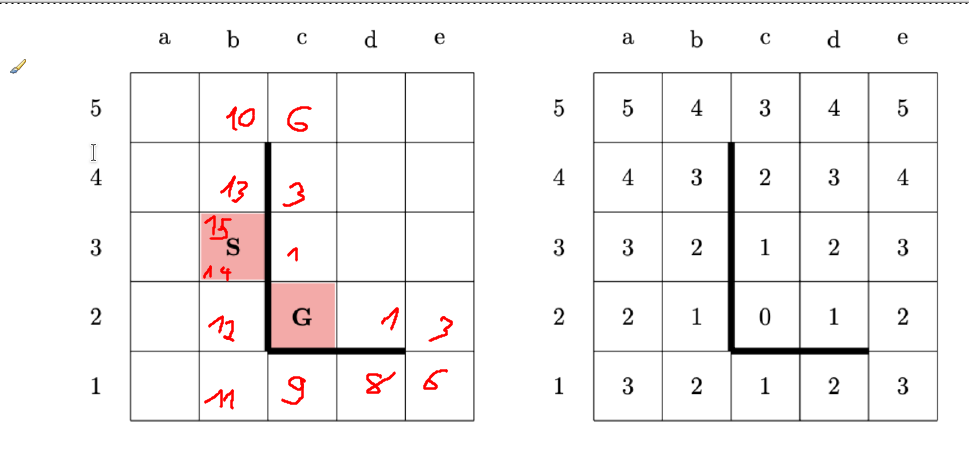
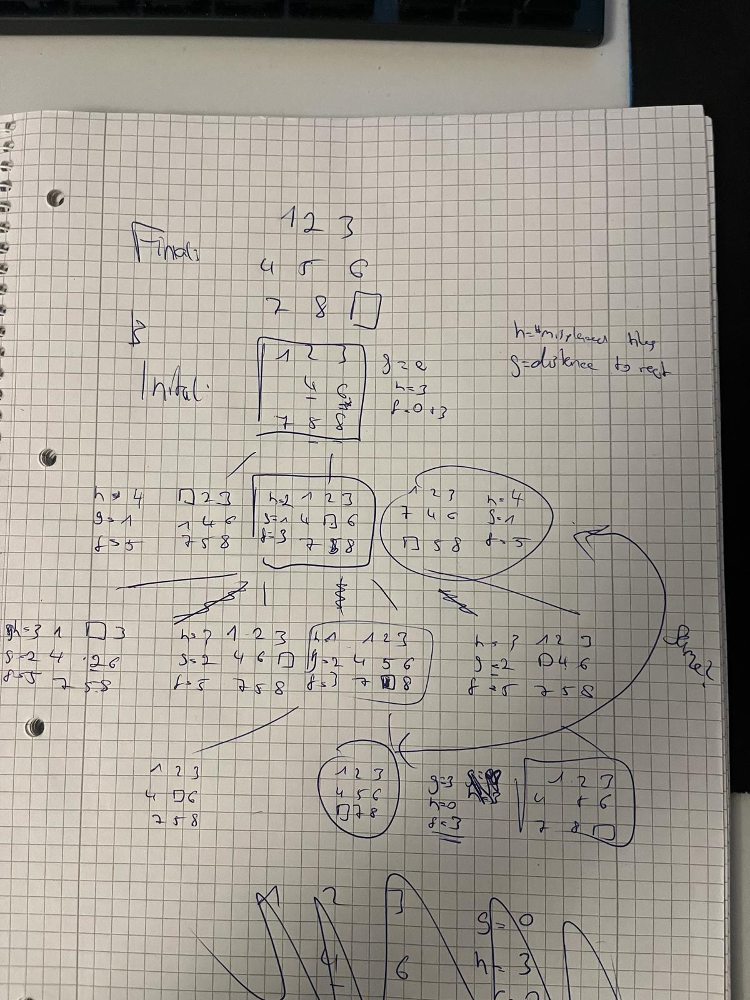

# Exercise Sheet 1
## Exercise 1 - Important Concepts

(a)
**Agent:** Entity that perceives its environment and acts in a way to achieve some goals

**Environment:** Surrounding, in which an agent operates and interacts

**Agent function:** a mapping from perceives sequences of environment states to actions by the agent

**Rationality:** ability of an agent to make decisions that maximize the chances to achieve a goal
Rationality != success

**Autonomy:** agent is able to operate without direct intervention from e.g. humans

**Simple reflex agent:** Responds directly to perceptions

**Model based agent:** Uses internal state to track aspects of the environment that are currently unnoticable

**Goal oriented agent:** Acts to achieve goals

**Benefit oriented agent:** Maximizes expected "satisfaction"

(b) Are reflexive actions - like pulling one’s hand back from a hot stove top - rational, intelligent,
or both?

(c) Justify why it makes sense to formulate a problem after formulating the goal.

(d)
State space: all possible configurations an agent could be in

State: the configuration of the agent at a certain time

Search tree: 

Goal: what the agent wants to achieve

Action: the moves an agent can do to get from one state into another
 
Successor function: 

Branching factor:

## Exercise 2 - Problem Formulation and Heuristics
(a)

(b)

(c)
a.
b.
c.

## Exercise 3 - Application of A* (1)
(a) (reverse the numbers!)

(b) yes, its manhattan distance

(c) 7

## Exercise 4: Application of A* (2)
(a) (check if same?)

(b)
5

(c)
a. no
b. create bigger distance as 1

## Exercise 5: Neighbor function for maximum clique and TSP

## Exercise 6: Tabu Search
local search methods (like hill climbing) have the tendency to become stuck in suboptimal regions
- worsening moves can be accepted, if no improving move is available
- tabus are introduced to discourage the search from coming back to previously visited solutions e.g. local optimum
- tabu tenure: tabu move is added to tabu list with certain value (tabu tenure):
  - with each iteration, the tabu tenure is decremented by one
  - when tenure = 0, move can be accepted (again?)
- aspiration criteria: allow tabu moves
  - e.g. when move allows a new global best solution AND all allowed moves are worse than the actual one
(a)

(b) Maximize the size of the clique

(c)

## Exercise 7: Tabu Search - Coding
(a)

(b)