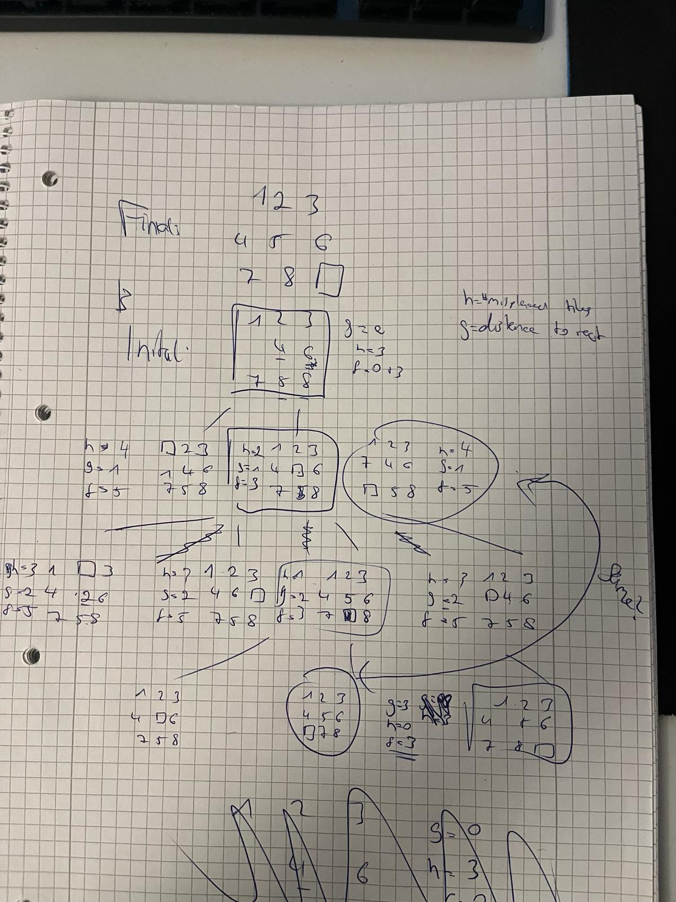

# Exercise Sheet 1
## Exercise 1 - Important Concepts

(a)
**Agent:** Entity that perceives its environment and acts in a way to achieve some goals

**Environment:** Surrounding, in which an agent operates and interacts

**Agent function:** a mapping from perceives sequences of environment states to actions by the agent

**Rationality:** ability of an agent to make decisions that maximize the chances to achieve a goal
Rationality != success

**Autonomy:** agent is able to operate without direct intervention from e.g. humans

**Simple reflex agent:** Responds directly to perceptions

**Model based agent:** Uses internal state to track aspects of the environment that are currently unnoticable

**Goal oriented agent:** Acts to achieve goals

**Benefit oriented agent:** Maximizes expected "satisfaction"

(b) Are reflexive actions - like pulling one’s hand back from a hot stove top - rational, intelligent,
or both?
Subquestion: What is the performance metric?
Answer: Negative burning degree
Rational (reflexive)
Not Intelligent

(c) Justify why it makes sense to formulate a problem after formulating the goal.

(d)

## Exercise 2 - Problem Formulation and Heuristics
(a) 
State space: {(i, j) für alle (i, j) element of V x V}
Successor function: (i, j) -> {(x, y) with (i, x) element E, (j, y) element E)
Goal: {(i, j) für alle element E ...
Step cost function: ..
TODO HERE
(b)
yes, since bouth have to move in each turn:
Only 2 cities A, B.

General answer: any chain with odd spacing

(c)
Definition: admissible: doesnt overestimate the real cost.
a. No, because the distance e.g. could be 10, but the maximum XYZ is 9.
b. No. even worse than a.
c. Yes. Place the 3rd city in the middle -> same length

## Exercise 3 - Application of A* (1)
what is g: steps we went so far
what is h:
(a) (reverse the numbers!)

(b) yes, doesnt overestimate the real cost
Why heuristic shall not overestimate?
Which node to expand next and when the algo can stop.
if TODO HERE, we would never be sure if we found the real optimum. but if it only underestimates, we can be sure if we found a real path (and the f values for the other paths is larger) we can be sure, that there is no better solution (global optimum)
(c) 7
TODO HERE
## Exercise 4: Application of A* (2)
(a) (check if same? Dont draw that again)

(b)
8, Because all tiles can be at the wrong place

(c)
a. no; TODO HERE
b. create bigger distance as 1

## Exercise 5: Neighbor function for maximum clique and TSP
How can a problem solution (state) be represented for these problems?
TSP: result array with length N (where N = #cities), where each index is the city to be visited in step i
neighbouring state: x where we just swap two states
MC: binary array. 1 = is in clique, 0 = is not in clique
how can a neighborig state be constructed given another state?
just one difference?

## Exercise 6: Tabu Search
local search methods (like hill climbing) have the tendency to become stuck in suboptimal regions
- worsening moves can be accepted, if no improving move is available
- tabus are introduced to discourage the search from coming back to previously visited solutions e.g. local optimum
- tabu tenure: tabu move is added to tabu list with certain value (tabu tenure):
  - with each iteration, the tabu tenure is decremented by one
  - when tenure = 0, move can be accepted (again?)
- aspiration criteria: allow tabu moves
  - e.g. when move allows a new global best solution AND all allowed moves are worse than the actual one
(a)

(b) Maximize the size of the clique
V, E and state (solution candidate)
0 if x does not represent a clique, sum(x) otherwise
Check if its a clique by loop over index i and j, and check.

(c) 2nd step: flip first -> tabu

## Exercise 7: Tabu Search - Coding
(a)

(b)

## Intermezzo
Hindsight Experience Replay
HER: if the agent failed to achieve the desired goal, he still achieved another goal:
so we got two rewards. actual reward = 0, virtual goal reward = 1

No Free Lunch Theorem:
Explain it in your own words