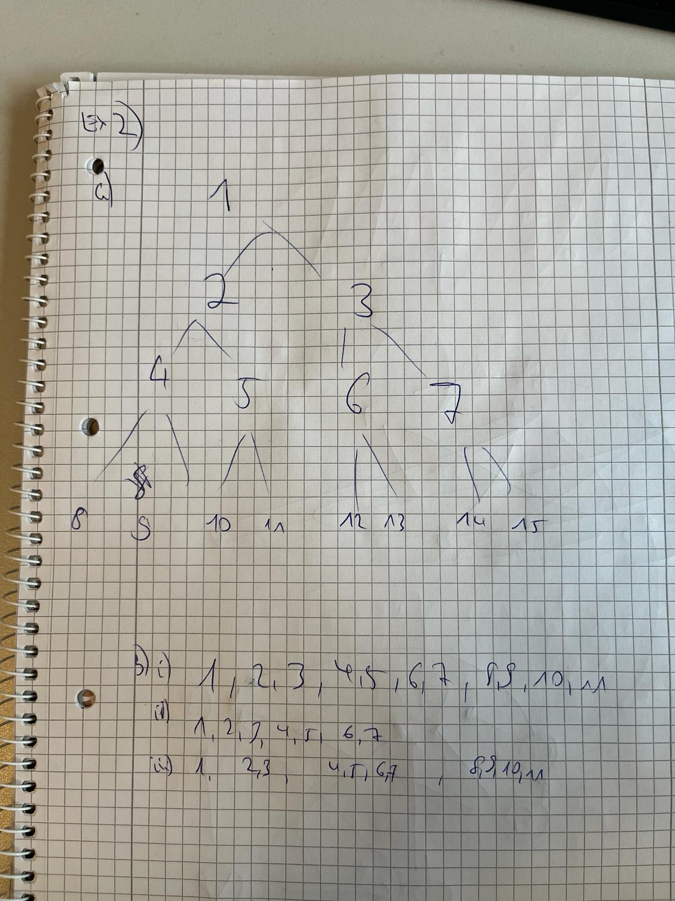

# Exercise Sheet 2
## Exercise 1: Questions
a) no. lucky punch can be quicker
b) Recap:
An admissible heuristic is one that is optimistic, meaning it predicts that the cost to get to the goal is less than or equal to the actual cost.
Yes.
c) modified versions: e.g. techniques like discretization of the state space,
Reason: While it's true that A* and many traditional search algorithms were initially designed for discrete problem spaces, there have been significant developments in adapting these algorithms for continuous domains, which are common in robotics.

d) If step costs of 0 are allowed, the search can enter an infinite loop on these zero-cost steps, thus potentially never reaching the goal state, making the search incomplete
Reason:
- algorithm progresses towards the goal without revisiting nodes, because each move to a new node increases the path cost, making progress towards deeper levels of the search tree.
- but with 0: This could lead to a situation where the algorithm keeps moving between such nodes indefinitely

e) Manhattan distance directly corresponds to the least number of moves needed(nature of rook), assuming there are no other pieces blocking its path.

## Exercise 2: Tree Search
a)

b)

i)
ii)
iii) IDDFS combines the space-efficiency of DFS with the completeness of BFS. It incrementally deepens the search depth

c) Yes, a bidirectional search could be more efficient for this problem because it reduces the search space significantly. Starting a backward search from 11 would quickly lead to 1 (11 → 5 → 2 → 1), and the forward search would meet the backward search effectively in fewer steps compared to a unidirectional search, especially in a balanced binary tree where the number of nodes doubles with each level.

## Exercise 3: Monte Carlo Tree Search
Terms:
MCTS: A decision-making algorithm that builds a search tree iteratively and uses random rollouts to estimate the long-term potential of each move.
Rollouts: In MCTS, a rollout is a simulation starting from a certain state and going to a terminal state using random actions. It is used to estimate the value of a state.
c exploration hyperparameter: This is used in the Upper Confidence Bound (UCB1) formula during the selection phase of MCTS. It balances exploration of unvisited or less visited nodes and exploitation of nodes known to have a good value.

## Exercise 4: Monte Carlo Tree Search

## Exercise 5: Questions
a. Use the matrix from exercise 3. Start from cell (2, 5) and always greedily choose the best
neighbor.

b. What happened and how does Tabu Search help prevent this?

c. At how many places of the Simulated Annealing algorithm is randomness used?

## Exercise 6: Membership Functions (Fuzzy Sets)

## Exercise 7: Fuzzy Operators
(a) OR = UNION
nothing

(b) AND = CUT

(c) NOT = COMPLEMENT

