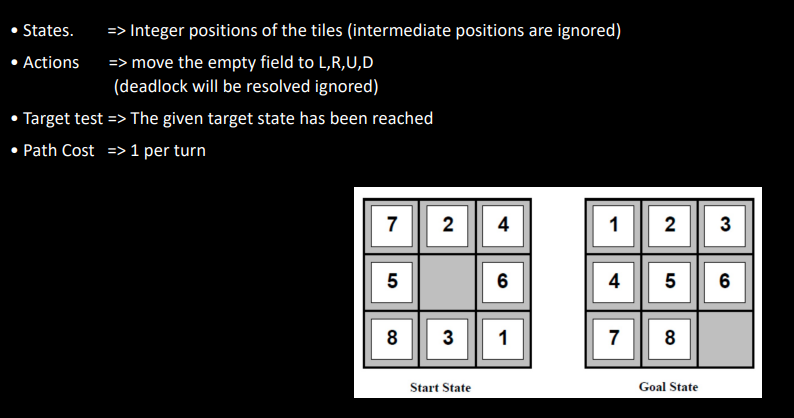

# VL 1 - Intelligent Systems

**What does PEAS stand for? Why need it?**
In order to design a rational agent, the task must be specified
- Performance Measures 
- Environment
- Actuators
- Sensors

**Examples for autonomous vehicle and bargain hunter:**

**Classify the types of enviroments for autonomous vehicle and bargain hunter:**

Reason why

**Name the 4 types of agents:**
• Simple reflex agent
• Model-based reflex agent
• Goal-oriented agent
• Benefit-oriented agent

**What type of agent is this:**
Simple Reflex Agent

Model-based reflex agent

Goal-Oriented Agent

Benefit-oriented (utility) agent

**What are the 2 steps between sensor input and action output?**

Name the Type of Problem that is depicted in the image and say why:

Name the States, the Actions, the Target test and the Path cost in this image:

Name the States, the Actions, the Target test and the Path cost in this image:

Name the States, the Actions, the Target test and the Path cost in this image:

## Key Takeways
