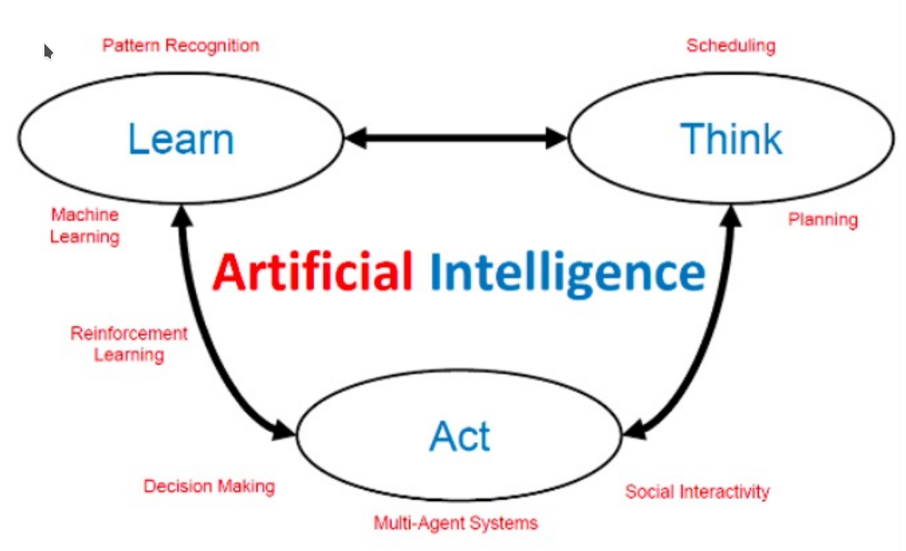
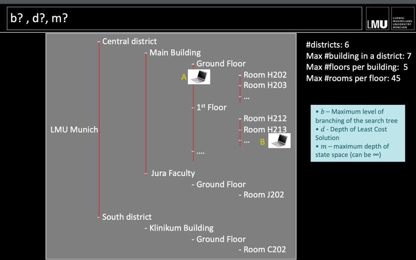
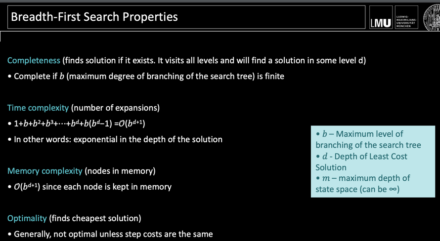
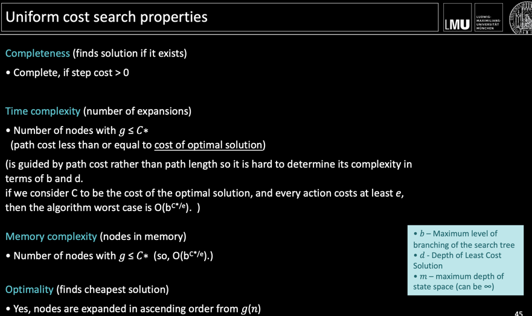
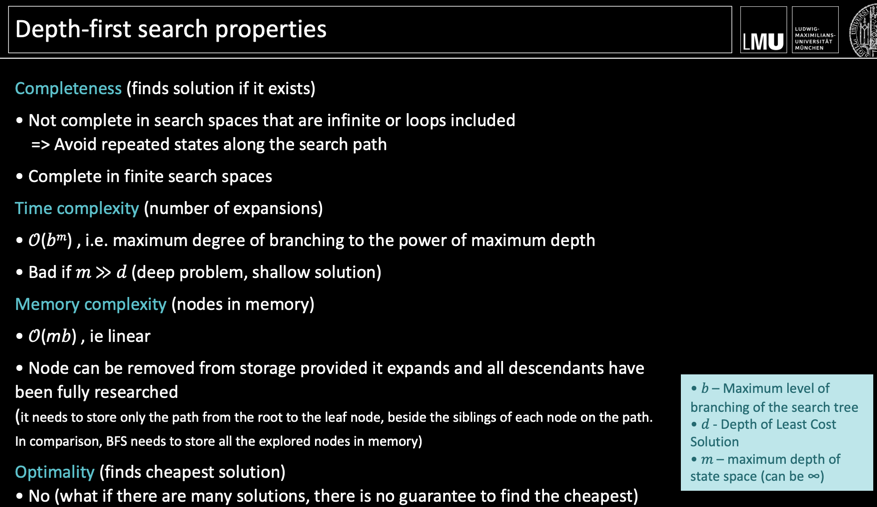
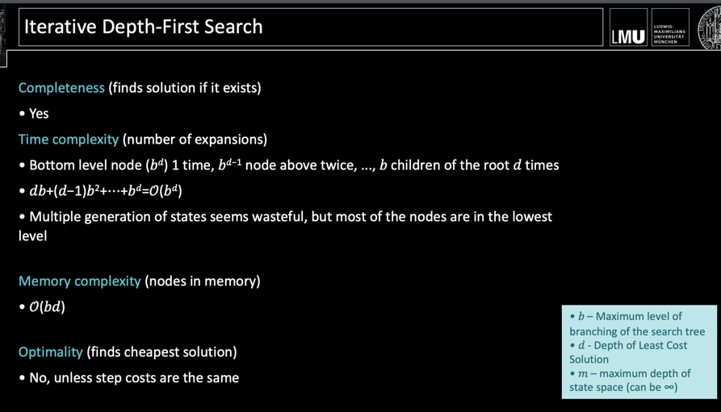
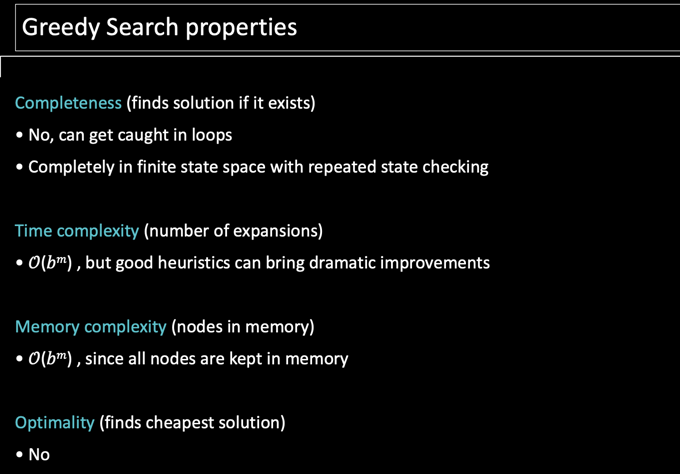
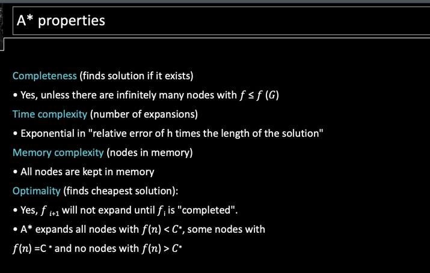
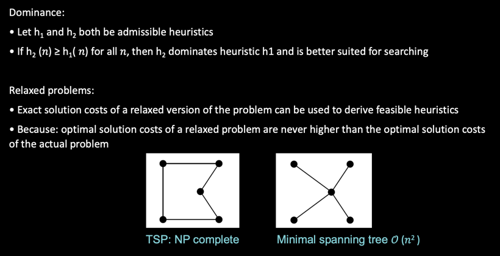

# VL 2 - Search - Heuristics
Fill out the grapic

What is Self-CHOP:
Autonomous ssstems operate without human intervention using:
- Configuration
- healing
- optimization
- protection

Rational Agents: do the right thing based on the information available
agent: is a function that maps the sequence of perception to actions
Artificial intelligence: includes the processes of thinking, acting and learning

Strategies are evaluated according to the following dimensions:
• Completeness: Always finds a solution when it exists?
• Time Complexity: Number of generated/expanded nodes
• Memory complexity: maximum number of nodes in memory
• Optimality: always finds the most cost-effective solution?

Time and memory complexity are measured using
• � – Maximum level of branching of the search tree
• � - Depth of Least Cost Solution
• � – maximum depth of state space (can be ∞)

What are uninformed strategies? Name 5:
Uninformed strategies use only the information available in the problem definition
- Breadth-First Search
• Uniform cost search
• Depth-first search
• Depth-limited search
• Iterative deepening depth-first search

Breadth-First Search:

Uniform cost:
Strategy: Expand the least expensive non-expanded node

DFS:

Constrained DFS:
- Basically, it is imposing a limit on the depth that DFS  can reach. The limit l solves  the infinite p
- Strategy: Expand the deepest, non-expanded node, where nodes of depth � have no children

Iterative deepening depth-first search:
 - Expand the deepest, non-expanded node, where nodes of depth � have no children

## Informed Search 3 Strategies
Greedy Search: Greedy search expands the node that seems
closest to the target

A*:

Monotony and Admissibility

Dominance and Relaxation:

keep going here.
