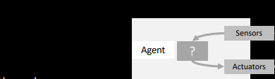

# VL 2 - Search - Heuristics
Fill out the grapic

What is Self-CHOP:
Autonomous ssstems operate without human intervention using:
- Configuration
- healing
- optimization
- protection

Rational Agents: do the right thing based on the information available
agent: is a function that maps the sequence of perception to actions
Artificial intelligence: includes the processes of thinking, acting and learning

keep going here.

