# VL 2 - Search - Heuristics
Fill out the grapic

What is Self-CHOP:
Autonomous ssstems operate without human intervention using:
- Configuration
- healing
- optimization
- protection

Autonomous systems
• ...operate without human intervention using Self-CHOP

Rational Agents: do the right thing based on the information available

Artificial intelligence: includes the processes of thinking, acting and learning

state vs node:
- state: is a physical configuration
- node: is a data structure that is part of a search tree
a node includes:  Includes predecessors, possibly children, depth �(�) and path costs �(�
- a state doesnt have that
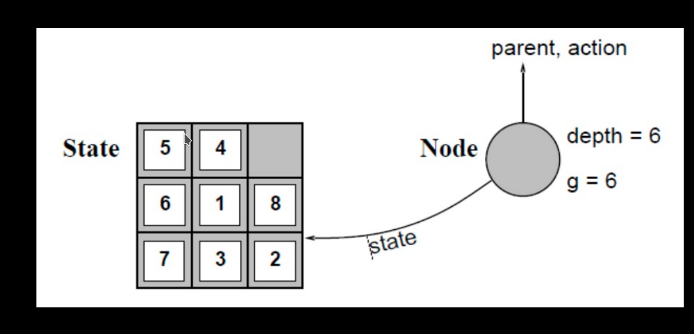

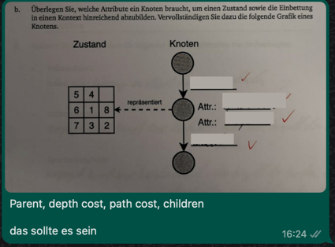

the expand function:
- creates new nodes; fills in fields, and uses the problem successor function to create corresponding stats 
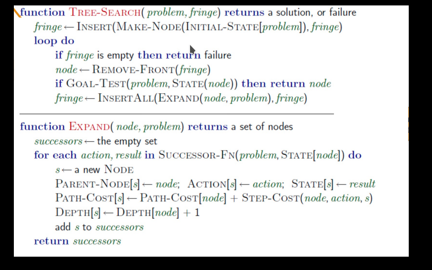

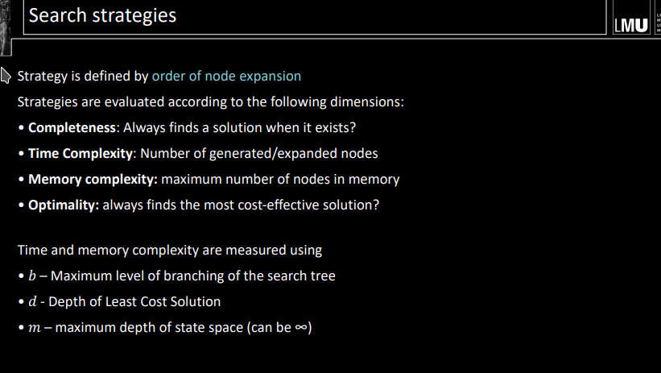

What are uninformed strategies? Name 5:
Uninformed strategies use only the information available in the problem definition
- Breadth-First Search
• Uniform cost search
• Depth-first search
• Depth-limited search
• Iterative deepening depth-first search

**look them up here**

Breadth-First Search:

Uniform cost:
Strategy: Expand the least expensive non-expanded node

DFS:

DFS: Stack
BFS: queue

Constrained DFS:
- Basically, it is imposing a limit on the depth that DFS  can reach. The limit l solves  the infinite p
- Strategy: Expand the deepest, non-expanded node, where nodes of depth � have no children

Iterative deepening depth-first search:
 - Expand the deepest, non-expanded node, where nodes of depth � have no children

## Informed Search 3 Strategies
Greedy Search: Greedy search expands the node that seems
closest to the target

A*:

**Monotony and Admissibility**
look here as well

Dominance and Relaxation:

## Key Takeaways
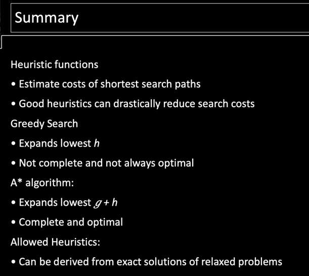

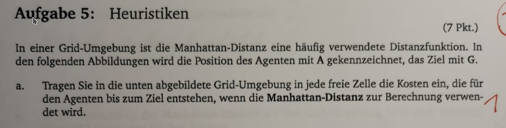
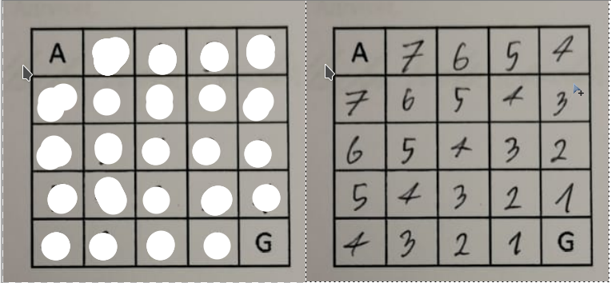

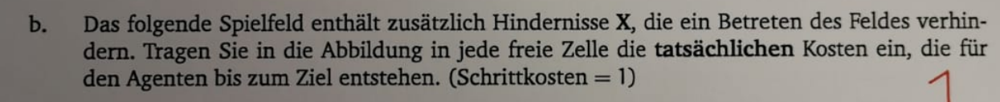
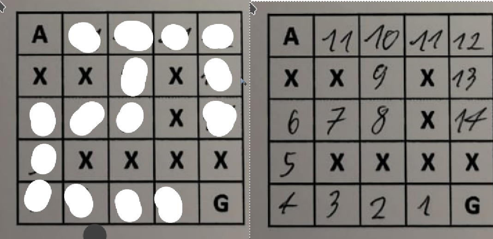

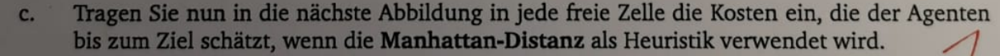
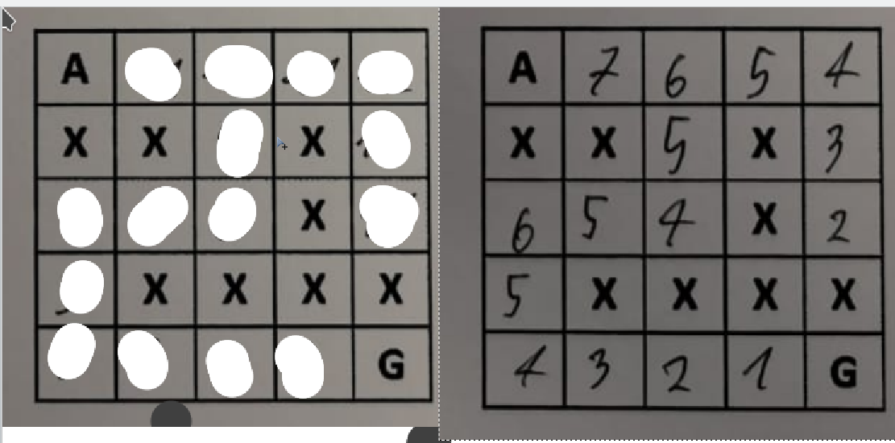