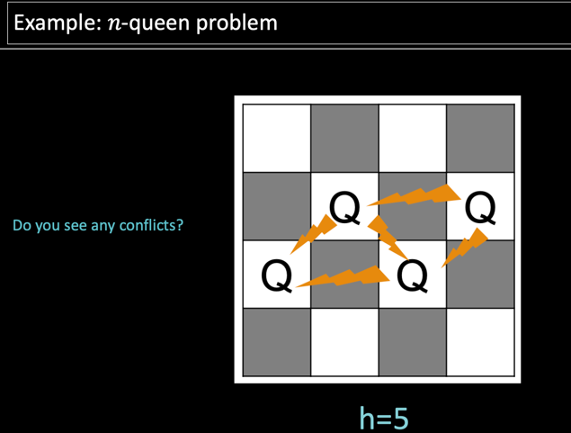
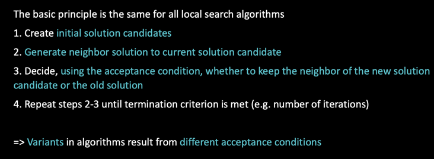
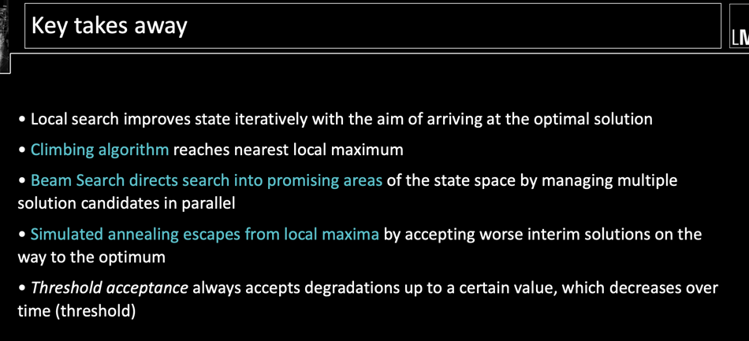
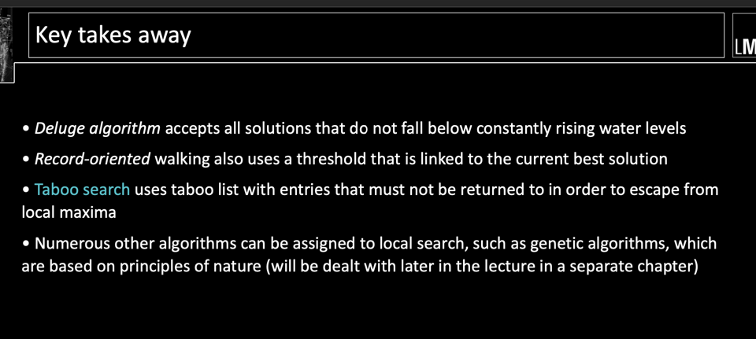
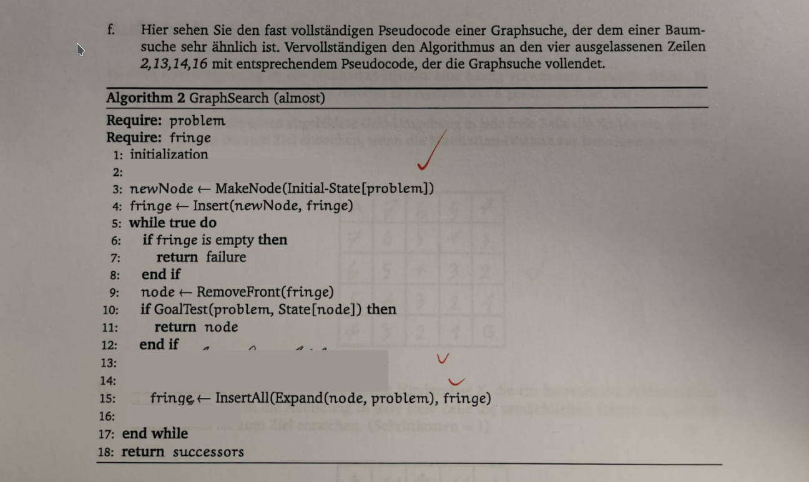
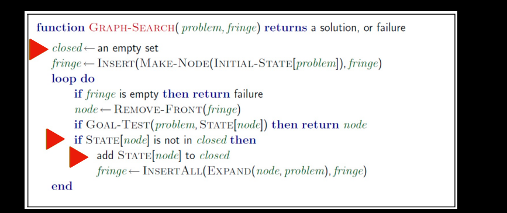

## Local search

How many conflicts:

Basic Algorithm:

## Hill-climbing Algorithm
- Gradient Descent
- • Idea: Climb a mountain. In the fog. With amnesia.

Process: As soon as a solution has been found that does not have a better neighbor, the algorithm
terminates and returns the current solution. Because: • In each iteration step, the best state is considered from the neighborhood of the current
solution

Problem: • Algorithm stops at nearest local maximum

## Local Beam Search
• Approach to avoid local maxima/minima
• Idea: instead of one, � solution candidates are managed in parallel

## Simulated Annealing 
Idea:
• Avoid local maxima by allowing "bad" movements
• Gradually reduce the size and frequency of bad moves

Modifications of simulated annealing take a different approach when accepting deterioration:
1. Threshold acceptance
2. Deluge algorithm
3. Record-oriented hiking

### Threshold acceptance
- same as SA, but: • Introduction of an upper limit for deteriorations (verschlechterung)
• Worse neighbor is only accepted if degree of the deterioration threshold does not exceed theta

### Deluge Algorithm
- • "Water Level" increases in each iteration
- • Free movement possible as long as "water" is not touched

### Record-oriented hiking
- again water level, but: • New: Level linked to the quality of the best solution found so far 
- • When a new best solution is found, the level jumps up accordingly

Hill climbinh vs. simulated annealing:
All modifications to the initial round trip result in worse round trips
• Global optimum (of this round trip) not achievable with Hill Climbing

## Tabu Search
- Local search method that takes "history" into account when creating new individuals
- Taboo lists prevent a return to the solution candidates just considered (they are “tabu” :) )

## Key takeaways

The primary difference between tree search and graph search lies in how they handle repeated states:

Tree Search:

Treats each node as unique, even if the states they represent have been encountered before.
Can potentially explore redundant paths or go in circles if the state space has loops.
Graph Search:

Keeps track of all the states it has already explored in a list (often called "closed set" or "explored set").

