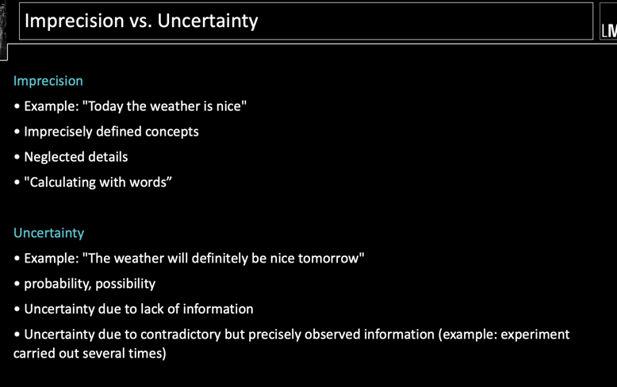
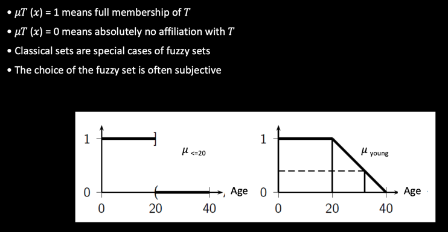
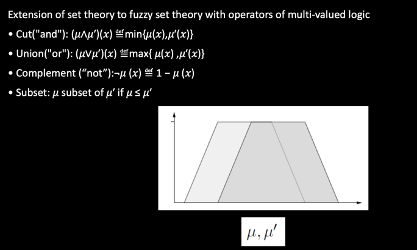
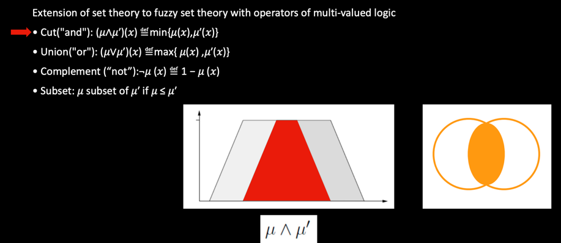
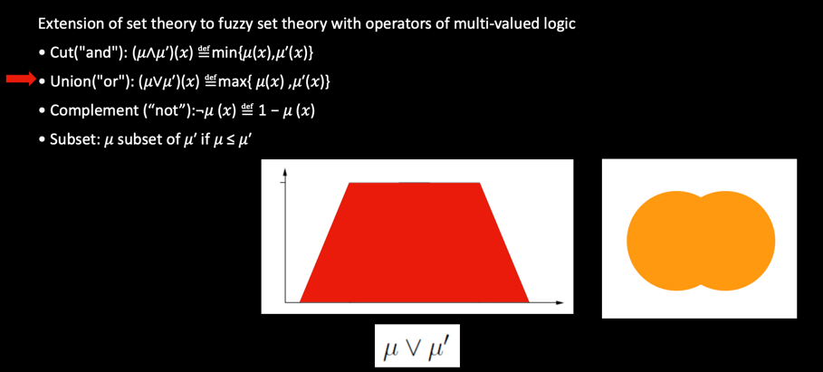
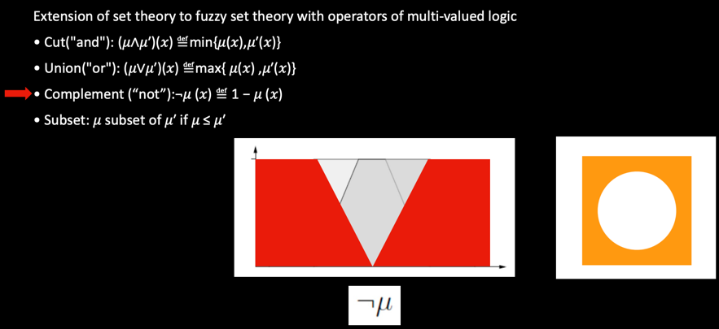
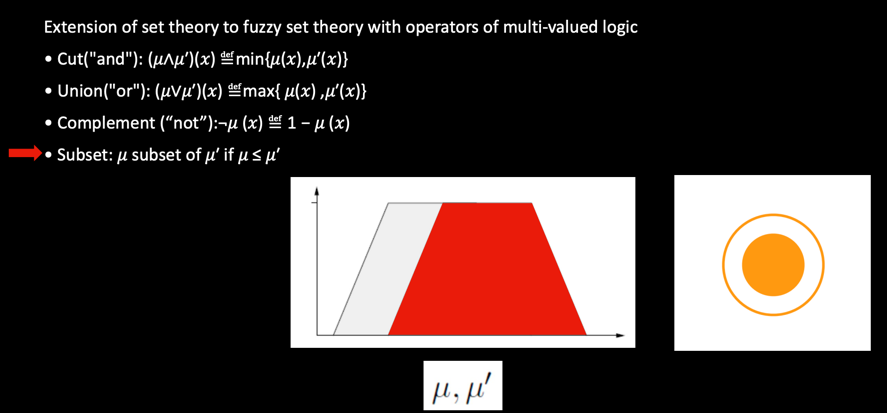

# Fuzzy Systems
We often express ourselves imprecisely / uncertainly:
• Fast, Large, About 12 o'clock, Old

### Fuzzy Sets

Linguistic variables and values
Example
• Linguistic variable: floor area of an apartment A
• Linguistic values: tiny, small, medium, large, huge

## Operators on Fuzzy Sets

