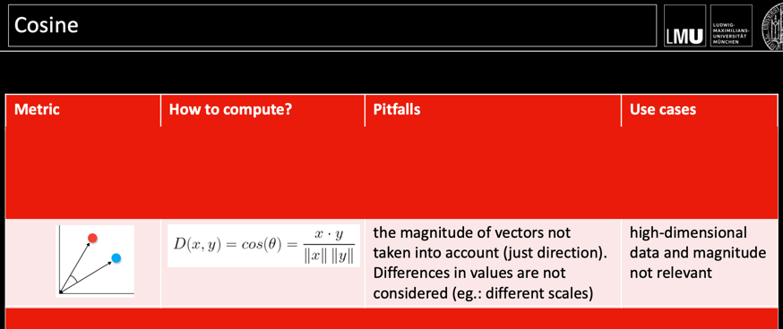

# Fuzzy clustering and Archetypal analysis

## Distance Functions

## k-means

## Delaunay triangulation and Voronoi diagram
Look at that!

Lidar height measurements projection

DBScan:
- in Nested clustering, K-means could lead to wrong clustering

## Fuzzy-Clustering 

## Archetypal Analysis
?

Real use of archetypes: Personas

