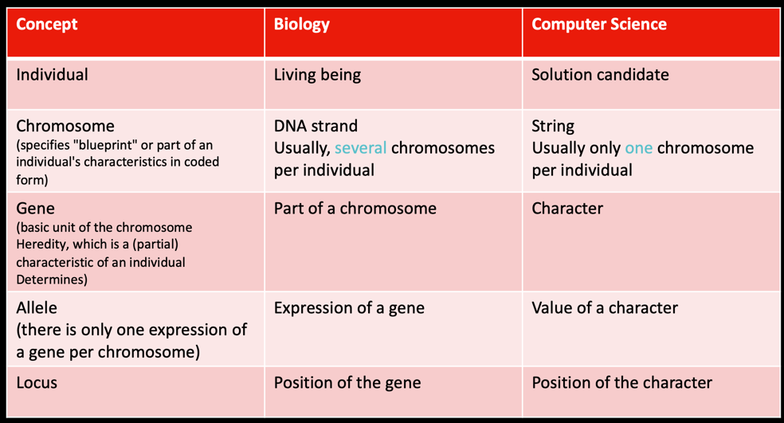

# Evolutionary Algorithms 1 and Optimization problems

Constraints

Explain: Prisoner's Dilemma Game Theory:

---

Name the three Evolution theory principles:
Diversity:
- All living beings are different, every genome is different.

Variation:
- New variants through mutation and genetic recombination

Inheritance:
- Variations are genetically passed on to the next generation

Speciation:
- Genetic divergence of individuals and populations lead to new species

Overproduction:
- In almost all living beings, not all offspring reach reproductive maturity

Natural Selection:
- survival of the fittest (adaptive though)

### Fill in the table:

### Elements of an Ev. algorithm
- Method that creates initial population
- Evaluation function for individuals (fitness function)
- Selection method based on fitness function
- Genetic operators changing solution candidates: 2 Types:
  - Mutation: Random change in individual genes
  - Crossover: Recombination of chromosomes
- Stop criteria

### Conceptual separation: evolutionary vs genetic:
Genetic Algorithm
• Encoding: string of zeros and ones
• => Chromosomes are bit strings (words via alphabet)

Evolutionary Algorithm
• Coding: Issue specific
• => String of letters, graphs, formulas, ...
• Genetic operators defined by coding and problem

Describe the The 𝑛 Queens Problem:
Place 𝑛 queens on 𝑛 × 𝑛 chessboard such that there is no more than one queen in any row, column, or diagonal

### Key takeaways:
What are evolutionary algorithms?
- based on natural methods in order to arrive at the (nearly) optimal solution

Describe the basic algorithm:
Repeated use of operators:
• Selection: Selection of individuals with the best Fitness values (for recombination and next generation)
• Recombination: Generation of new individuals
• Mutation: change of individuals
Solution is the best individual of the population created by applying the algorithm

Selection principles – implementing the selection “pressure”:
Describe the selection principle Selection “pressure”:
- Better individuals (higher fitness) should have a greater chance of producing offspring

Exploration vs. exploitation:
Good strategy: Time-dependent selection pressure
• Low selection pressure in previous generations
• Greater selection pressure in later generations
Þ Firstthinningofthesearcharea,thenexploitationofthemostpromisingregion

Name 2 modified forms of EA:
- memetic and cultural algorithms