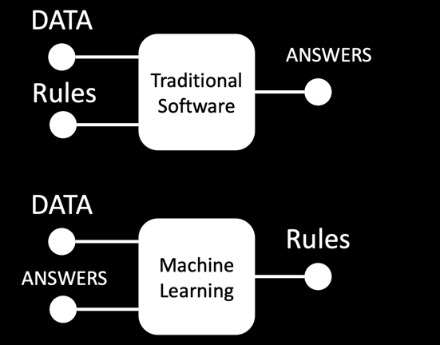

### Rule based vs. ML

ML: get a computer to learn patterns

3 things you need: Data, Model, Cost

ML examples: classification, regression, clustering

The Bias-Variance balance in the model capacity:
High Variance: Overfitting
High Bias: Underfitting

Name 5 hyperparameters in NN:
- batchsize, epochs, neurons in hidden layer, hidden layers, loss function

Regularization – addressing overfitting:
one option: lower the weights
A weight represent the importance of the importance of the previous neuron (input,
hidden layer, etc)
Overfitting means exaggerating the importance of a data point (e.g.: the model follows
too much the inputs)
The intuitive solution is to lower the weights to lower the importance of the data point

- Dropout

Batch Normalization:
Normalization: collapsing inputs between 0 and 1

## Batch noramlization => more calculations. Does it make the whole training slower?
- Each epoch takes longer, but the convergence is faster
- It achieves the same accuracy faster

## Why do we have activation functions?
- Otherwise the network can‘t learn complex models (just linear transformations)

## What is the idea of auto encoders?
- We encode the input data X into a smaller space and we try to decode it back (aka reconstruct the input data X as X‘)

## CNN: Why fully connected layers don‘t work well for images?
- 100px by 100px => 10000 inputs and 10000 outputs even if we consider just one channel (not RGB) 100 m neuron connections
- Each pixel contributes equally (relative position is irrelevant) => it doesn‘t make sense (pixels closer to each other
make up features like an edge, and eye, etc

Convolutional layers make more sense:
- Each output for a pixel is determined by a grid of surrounding input pixels
- The output pixel is computed by multiplying the surrounding input pixels by the Kernel and then adding everything up

## Computer vision levels:
- image classification: The network just labels what it is in the image
- Image Classification and location: The network just labels what it is in the image and
adds a bounding box (we still assume only 1)
- object detection: The network just labels mutliple objects of the  same or different classes and adds the bounding  boxes for every one
- Semantic segmentation: The network assigns a label to each pixel in the
image (in the example to just one object). So it doesnt draw a box but the exact shape of the object e.g. cat.
- Instance segmentation: The network can identify multiple instances of the  same object

## Why is attention important?
- Position matters for the input (!) The man stops the car. The car stops the man.
- 

## Autoregressive vs. Masked Transformer
Describe what they are  and name an example what they are commonly used for.

**Autoregressive Transformer:**
- predict the next token conditioned on the previous tokens: This is a  → sentence
- Unidirectional context
- commonly used for: Text generation

**Masked Transformers:**
-  Randomly replace tokes with a mask: This is a sentence. → This is [MASK] sentence.
- Predict the masked tokens
- Bidirectional context
- BERT (Bidirectional Encoder Representations from Transformers)
- Commonly used for: Text Classification, Named Entity Recognition and Question Answering

## Explain the differnewce in pretraining and fine tuning. What is Parameter efficient finetuning
- pretraining: unlabeled text corpus, unsupervised pretraining
- conventional finetuning: smaller target dataset (original model params -> very expensive)
- param-efficient-finetuning: smaller target dataset (freeze original weights, add and finetune additional parameters -> cheaper)

3 advantages: faste training, fewer data required, easier distribution

### Methods for Finetuning
- Supervised Finetuning: Used, when the answer is unique
- Applications: teach classification
- Examples: Prompt: What is the most famous song of Coldplay? Viva La Vida

- Unsupervised Finetuning: Used, when we want the model the familiarize with special texts without
answering any specific question
- Applications: e.g. Learn documentation of a company

## Describe RLHF in your own words
- we have humans rank answers of the models output to get labeled data
- These human evaluations are then used to train a Reward Model
- Tuned Language Model (RL Policy): The base model's parameters are fine-tuned (most frozen) with supervised learning to generate responses that align with desired outcomes
- Ensures that the updated policy (the RL-tuned model) doesn't deviate too far from the behavior of the base model

## what is a tokenizer?
- A tokenizer is a tool that converts text input into a format understandable by a machine learning model, often by breaking it down into tokens or subwords

## what is a distilmodel?
- A distilmodel is a smaller, faster version of a larger machine learning model that retains most of its original accuracy, created through a process known as distillation.

## what are logits?
- raw output, before applying softmax

## Why 8 token and not 6
- text = "This is a great [MASK]."
- tensor([[ 101, 2023, 2003, 1037, 2307,  103, 1012,  102]])
- torch.Size([1, 8, 30522])
- Reason: <SOS>, <EOS>

# interpret the result
- mask_token_index = torch.where(inputs["input_ids"] == tokenizer.mask_token_id)[1]
- mask_token_logits = token_logits[0, mask_token_index, :]
- print(mask_token_index)
- print(mask_token_logits.shape)
- -torch.Size([1, 30522])
- logits for each vocab in vocabulary

What happens here:
- chunk_size = 128
- lm_datasets = tokenized_datasets.map(group_texts, batched=True)
- data_collator = DataCollatorForLanguageModeling(tokenizer=tokenizer, mlm_probability=0.15) 
- randomly replace tokens with [MASK]

- tokenized_datasets = imdb_dataset.map(tokenize_function, batched=True, remove_columns=["text", "label"])
- tokenize the dataset (25_000 reviews)

- print(lm_datasets) what you expect this to have?
- 61_000 chunks, each containing 128 tokens

- sample = lm_datasets["train"][0] 
- sample = first chunk (128 tokens) in "input_ids"
 
## what is a chunk?
- tensor, containing 128 integers. Decode it using the tokenizer
- tokenizer.decode(chunk)