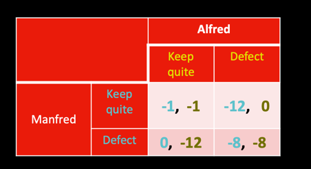
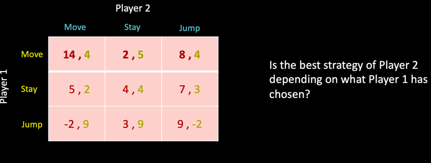
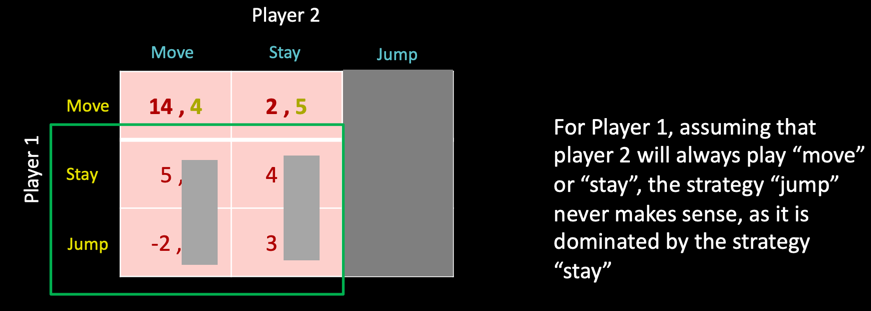
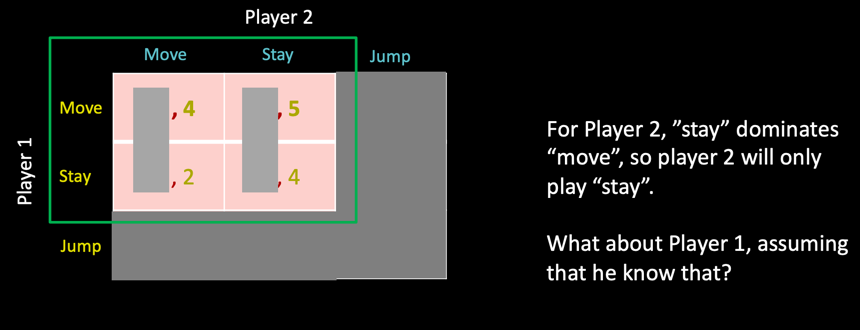
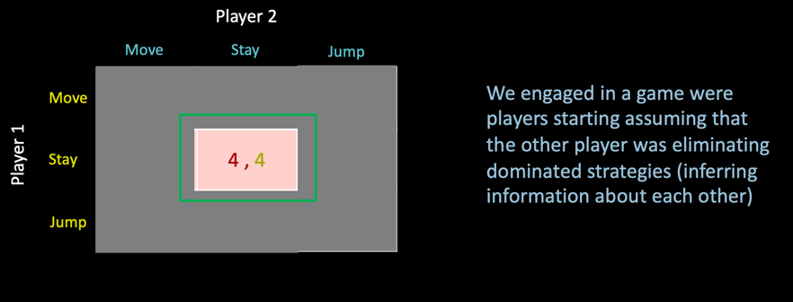
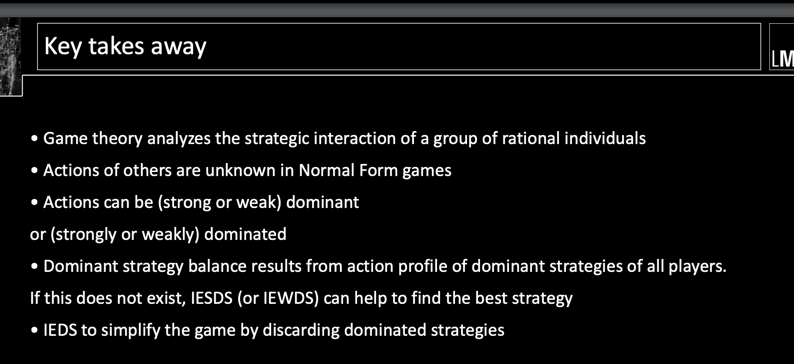
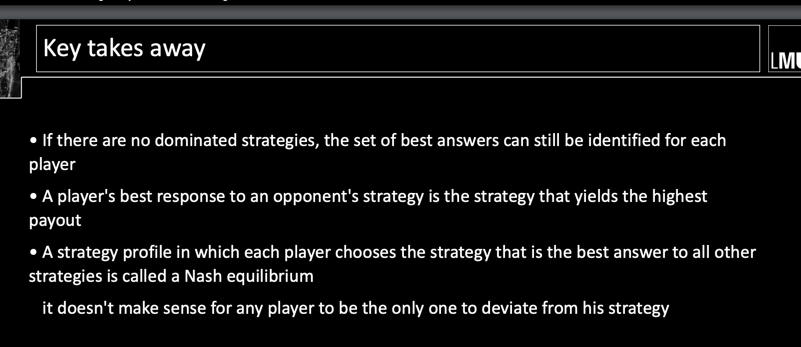

- No matter what Alfred does, Manfred is better off defecting Manfred’s “defect” strategy  strictly dominates Manfred’s  “keep quiet” strategy
- But why is this outcome not better for both?

## Iterated Elimination of Strictly Dominated Strategies
- What if in a game not all the times a strategy is the best one?
- What if a game does not have a dominant strategy?
- What if a player is better off changing his/her strategy depending
on how the other player plays?

- Would player 2 ever want to play “jump”? No, because “stay” always yields better results than “jump”(“stay” strictly dominates “jump”)
- Player 2 can focus on just “move” and “stay” strategies Let’s assume Player 1 has figured out that Player 2 just play “move” and “stay”… What  would then he do?

- How would Player 2 decide now?

- Player 1 would play “stay”, as it dominates “move”

- The STRICTELY DOMINATED STRATEGIES ELIMITATION technique is not impacted by the order

## IESDS vs. IEWDS 
- order matters vs. order doesnt matter

## Nash 2 Equilibrium
- Nash Equilibrium is a set of strategies (one per player), so that no player has any incentive to change his/her own strategy:
Check example: is this a nash equilibrium

